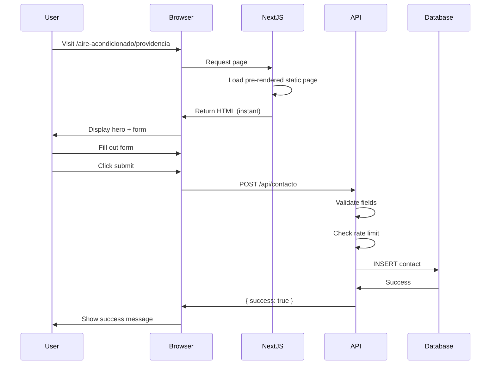

## Overview

Polaris Clima generates location-specific landing pages for 18 communes in Santiago using Next.js dynamic routes. Each page is optimized for local SEO with customized metadata and content.

**Route Pattern**: `/aire-acondicionado/[comuna]`

**Location**: `app/aire-acondicionado/[comuna]/page.tsx`

## Architecture

```
Dynamic Route System
├── [comuna]/
│   ├── page.tsx (route handler)
│   └── FormContacto.tsx (page component)
│
├── Static Generation
│   └── generateStaticParams() → 18 pre-rendered pages
│
├── Dynamic Metadata
│   └── generateMetadata() → SEO for each commune
│
└── Validation
    └── comunasValidas array
```

## Supported Communes

<CodeGroup>
```typescript Commune List
const comunasValidas = [
  "santiago",
  "providencia",
  "nunoa",
  "las-condes",
  "vitacura",
  "la-reina",
  "macul",
  "san-joaquin",
  "san-miguel",
  "independencia",
  "recoleta",
  "estacion-central",
  "quinta-normal",
  "pedro-aguirre-cerda",
  "lo-prado",
  "cerrillos",
  "huechuraba",
  "conchali"
];
```

```typescript URL Format
// Slug format: lowercase with hyphens
/aire-acondicionado/las-condes
/aire-acondicionado/pedro-aguirre-cerda
/aire-acondicionado/estacion-central

// Display format: Title Case
Las Condes
Pedro Aguirre Cerda
Estación Central
```
</CodeGroup>

<Info>
**18 communes** covering Santiago's metropolitan area, focusing on high-demand residential and commercial zones.
</Info>

## Static Site Generation

### Pre-rendering All Communes

<CodeGroup>
```typescript generateStaticParams
export async function generateStaticParams() {
  return comunasValidas.map(c => ({ comuna: c }));
}

// Generates at build time:
// { params: { comuna: 'santiago' } }
// { params: { comuna: 'providencia' } }
// { params: { comuna: 'nunoa' } }
// ... 15 more
```

```bash Build Output
○ /aire-acondicionado/[comuna]  (Static)
  ├ /aire-acondicionado/santiago
  ├ /aire-acondicionado/providencia
  ├ /aire-acondicionado/nunoa
  └ ... (18 total pages)
```
</CodeGroup>

<Tip>
Using `generateStaticParams` means all 18 commune pages are pre-built at compile time, resulting in instant page loads with no server-side rendering overhead.
</Tip>

## Dynamic Metadata

### SEO Optimization per Commune

<CodeGroup>
```typescript generateMetadata Function
type Props = {
  params: Promise<{ comuna: string }>;
};

export async function generateMetadata({ params }: Props): Promise<Metadata> {
  const { comuna } = await params;

  // Validate commune exists
  if (!comunasValidas.includes(comuna)) {
    return {
      title: "Servicio de Aire Acondicionado en Santiago",
      description: "Instalación, mantención y reparación de aire acondicionado en Santiago.",
    };
  }

  const comunaFormateada = formatComuna(comuna);

  return {
    title: `Aire Acondicionado en ${comunaFormateada}`,
    description: `Instalación, mantención y reparación de aire acondicionado en ${comunaFormateada}. Servicio profesional a domicilio.`,
  };
}
```

```typescript Format Helper
function formatComuna(slug: string) {
  return slug
    .replace(/-/g, " ")           // Replace hyphens with spaces
    .replace(/\b\w/g, l => l.toUpperCase()); // Title case
}

// Examples:
formatComuna('las-condes')              // → "Las Condes"
formatComuna('pedro-aguirre-cerda')     // → "Pedro Aguirre Cerda"
formatComuna('estacion-central')        // → "Estacion Central"
```
</CodeGroup>

### Metadata Examples

<Tabs>
  <Tab title="Las Condes">
    ```html
    <title>Aire Acondicionado en Las Condes | Polaris Clima</title>
    <meta name="description" content="Instalación, mantención y reparación de aire acondicionado en Las Condes. Servicio profesional a domicilio.">
    ```
  </Tab>
  
  <Tab title="Providencia">
    ```html
    <title>Aire Acondicionado en Providencia | Polaris Clima</title>
    <meta name="description" content="Instalación, mantención y reparación de aire acondicionado en Providencia. Servicio profesional a domicilio.">
    ```
  </Tab>
  
  <Tab title="Ñuñoa">
    ```html
    <title>Aire Acondicionado en Nunoa | Polaris Clima</title>
    <meta name="description" content="Instalación, mantención y reparación de aire acondicionado en Nunoa. Servicio profesional a domicilio.">
    ```
  </Tab>
</Tabs>

## Page Component Structure

### Main Route Handler

<CodeGroup>
```tsx page.tsx
export default async function Page({ params }: Props) {
  const { comuna } = await params;

  // Validate commune
  if (!comunasValidas.includes(comuna)) {
    return <div className="p-20 text-center">Comuna no disponible</div>;
  }

  const comunaFormateada = formatComuna(comuna);

  return (
    <FormContacto comuna={comunaFormateada} />
  );
}
```
</CodeGroup>

<Warning>
Invalid commune slugs show a "Comuna no disponible" message instead of 404. This provides better UX for typos or unlisted areas.
</Warning>

## FormContacto Component

**Location**: `app/aire-acondicionado/[comuna]/FormContacto.tsx`

### Hero Section with Parallax

<CodeGroup>
```tsx Hero Component
<div className="relative h-[90vh] w-full overflow-hidden">
  {/* Background Image */}
  <div
    className="absolute inset-0 bg-fixed"
    style={{
      backgroundImage: "url('/contact-persona.png')",
      backgroundSize: 'cover',
      backgroundPosition: 'center 40%',
      backgroundRepeat: 'no-repeat',
    }}
  />
  
  {/* Dark Overlay */}
  <div className="absolute inset-0 bg-black/50" />

  {/* Content */}
  <div className="relative z-10 flex flex-col items-center justify-center h-full text-white text-center px-4">
    <h1 className="text-4xl md:text-6xl font-bold mb-4">
      Aire Acondicionado en {comuna}
    </h1>
    <p className="text-lg md:text-xl max-w-2xl font-light">
      Instalación, mantención y reparación profesional en {comuna}
    </p>

    {/* Scroll Button */}
    <button
      onClick={() => {
        document.getElementById('formulario')?.scrollIntoView({ behavior: 'smooth' });
      }}
      className="mt-12 animate-bounce bg-white/20 hover:bg-white/40 backdrop-blur-sm rounded-full p-3"
    >
      <svg className="h-8 w-8 text-white" fill="none" viewBox="0 0 24 24" stroke="currentColor">
        <path strokeLinecap="round" strokeLinejoin="round" strokeWidth={3} d="M19 9l-7 7-7-7" />
      </svg>
    </button>
  </div>
</div>
```
</CodeGroup>

**Key Features**:
- 90vh full-screen hero
- Fixed background for parallax effect
- Commune name dynamically inserted in heading
- Animated scroll-down button
- Dark overlay for text contrast

### Contact Form Section

<CodeGroup>
```tsx Form Integration
const { loading, success, errorMessage, handleSubmit, handleChange, fieldProps } =
  useContactForm(`aire-acondicionado-${comuna.toLowerCase().replace(/\s+/g, '-')}`);

return (
  <section id="formulario" className="relative z-20 w-full bg-[#e9e9e9] py-20">
    <div className="max-w-7xl mx-auto grid md:grid-cols-2 gap-10 items-start px-6">
      
      {/* Form Column */}
      <div className="w-full">
        <h2>Contáctanos</h2>
        
        {success && <FormAlert type="success" message="¡Gracias por contactarnos!" />}
        {errorMessage && <FormAlert type="error" message={errorMessage} />}
        
        <form onSubmit={handleSubmit}>
          <InputField placeholder="Nombre*" {...fieldProps('nombre')} />
          <InputField placeholder="Apellido*" {...fieldProps('apellido')} />
          <InputField type="email" placeholder="Correo*" {...fieldProps('email')} />
          <InputField type="tel" placeholder="Teléfono*" {...fieldProps('telefono')} />
          <textarea name="mensaje" placeholder="Mensaje" />
          
          <button type="submit" disabled={loading}>
            {loading ? 'Enviando...' : 'ENVIAR'}
          </button>
        </form>
      </div>

      {/* Image Column */}
      <div className="relative w-full h-[420px] md:h-[480px]">
        <Image src="/contactanos.png" alt="Contacto" fill />
      </div>
    </div>
  </section>
);
```

```typescript Origin Tracking
// Form submissions are tagged with the commune
const origen = `aire-acondicionado-${comuna.toLowerCase().replace(/\s+/g, '-')}`;

// Examples:
// "aire-acondicionado-las-condes"
// "aire-acondicionado-providencia"
// "aire-acondicionado-nunoa"

// This allows tracking which communes generate the most leads
```
</CodeGroup>

### Design Elements

<Accordion title="Rounded Top Section">
```tsx
className="rounded-t-3xl -mt-8 shadow-[0_-20px_40px_rgba(0,0,0,0.3)]"
```

Creates an overlapping effect where the form section curves over the hero image.
</Accordion>

<Accordion title="Two-Column Layout">
```tsx
grid md:grid-cols-2 gap-10
```

- Left: Contact form
- Right: Illustration image
- Stacks vertically on mobile
</Accordion>

<Accordion title="Form Styling">
- Light gray background: `bg-[#e9e9e9]`
- White input fields with shadow
- Indigo submit button: `bg-indigo-600`
- Loading state disables button
</Accordion>

## User Journey



## URL Structure & Sitemap

### Sitemap Integration

**Location**: `public/sitemap.xml`

<CodeGroup>
```xml Commune URLs in Sitemap
<url>
  <loc>https://www.polarisclima.cl/aire-acondicionado/santiago</loc>
  <lastmod>2026-02-26</lastmod>
  <changefreq>monthly</changefreq>
  <priority>0.8</priority>
</url>

<url>
  <loc>https://www.polarisclima.cl/aire-acondicionado/providencia</loc>
  <lastmod>2026-02-26</lastmod>
  <changefreq>monthly</changefreq>
  <priority>0.8</priority>
</url>

<!-- ... 16 more commune URLs -->
```
</CodeGroup>

**SEO Priority**: 0.8 (high priority for local landing pages)

## Local SEO Benefits

<CardGroup cols={2}>
  <Card title="Geo-Targeted Content" icon="location-dot">
    Each page mentions the specific commune multiple times in titles, headings, and content
  </Card>
  
  <Card title="Unique Metadata" icon="tag">
    Every commune gets custom title and description tags for search engines
  </Card>
  
  <Card title="Structured Data" icon="code">
    LocalBusinessSchema includes all served communes in `areaServed` property
  </Card>
  
  <Card title="Static Performance" icon="bolt">
    Pre-rendered pages load instantly, improving SEO ranking signals
  </Card>
</CardGroup>

## Adding New Communes

<Steps>
  <Step title="Add to comunasValidas Array">
    ```typescript
    const comunasValidas = [
      // ... existing communes
      "nueva-comuna", // Add slug format
    ];
    ```
  </Step>
  
  <Step title="Rebuild Application">
    ```bash
    npm run build
    ```
    
    Next.js will automatically generate the new static page.
  </Step>
  
  <Step title="Update Sitemap">
    Add new URL to `public/sitemap.xml`:
    ```xml
    <url>
      <loc>https://www.polarisclima.cl/aire-acondicionado/nueva-comuna</loc>
      <lastmod>2026-03-04</lastmod>
      <changefreq>monthly</changefreq>
      <priority>0.8</priority>
    </url>
    ```
  </Step>
  
  <Step title="Update LocalBusinessSchema">
    Add to `areaServed` array in `components/LocalBusinessSchema.tsx`:
    ```typescript
    areaServed: [
      // ... existing communes
      { "@type": "City", name: "Nueva Comuna" },
    ]
    ```
  </Step>
  
  <Step title="Update ServiceSchema">
    Same as above for `components/ServiceSchema.tsx`
  </Step>
</Steps>

## Performance Considerations

<Accordion title="Static Generation Trade-offs">
**Pros**:
- Instant page loads (served as static HTML)
- No server-side rendering overhead
- Better SEO (consistent, fast pages)
- Lower server costs

**Cons**:
- Pages only update on rebuild
- Adding communes requires redeployment
- Cannot have infinite dynamic communes
</Accordion>

<Accordion title="Image Optimization">
```tsx
<Image
  src="/contact-persona.png"
  fill
  className="object-cover"
  priority // Load immediately (above fold)
  sizes="100vw" // Full width
/>
```

Next.js automatically optimizes images:
- WebP format for modern browsers
- Responsive srcset generated
- Lazy loading (except priority images)
</Accordion>

<Accordion title="Background Attachment">
```css
bg-fixed
```

Creates parallax effect but can impact mobile performance. Consider:
- Using `bg-scroll` for mobile
- Media query to disable on small screens
- Testing on actual devices
</Accordion>

## Analytics & Tracking

### Origin Parameter

Each form submission includes the commune in the `origen` field:

```typescript
const origen = `aire-acondicionado-${comuna.toLowerCase().replace(/\s+/g, '-')}`;
```

**Use cases**:
- Track which communes generate most leads
- Calculate conversion rates by location
- Identify high-value service areas
- Optimize marketing spend by geography

### Query Leads by Commune

<CodeGroup>
```sql Get Leads by Commune
SELECT 
  origen,
  COUNT(*) as total_leads,
  DATE(created_at) as date
FROM contactos
WHERE origen LIKE 'aire-acondicionado-%'
GROUP BY origen, DATE(created_at)
ORDER BY total_leads DESC;
```

```sql Top Performing Communes
SELECT 
  REPLACE(REPLACE(origen, 'aire-acondicionado-', ''), '-', ' ') as comuna,
  COUNT(*) as leads,
  ROUND(COUNT(*) * 100.0 / SUM(COUNT(*)) OVER (), 2) as percentage
FROM contactos
WHERE origen LIKE 'aire-acondicionado-%'
  AND created_at >= DATE_SUB(NOW(), INTERVAL 30 DAY)
GROUP BY origen
ORDER BY leads DESC
LIMIT 10;
```
</CodeGroup>

## Testing

<Tabs>
  <Tab title="Test Valid Commune">
    ```bash
    # Visit in browser
    http://localhost:3000/aire-acondicionado/providencia
    
    # Should show:
    # - Hero with "Aire Acondicionado en Providencia"
    # - Contact form
    # - Correct metadata in page source
    ```
  </Tab>
  
  <Tab title="Test Invalid Commune">
    ```bash
    # Visit in browser
    http://localhost:3000/aire-acondicionado/invalid-comuna
    
    # Should show:
    # "Comuna no disponible" message
    ```
  </Tab>
  
  <Tab title="Test Form Submission">
    ```bash
    # Fill out form with test data
    # Click submit
    # Check browser network tab for POST to /api/contacto
    # Verify success message appears
    # Check database for new record with correct origen
    ```
  </Tab>
</Tabs>

## Related Documentation

- [Contact System](/features/contact-system) - Form submission API
- [SEO Optimization](/features/seo-optimization) - Structured data schemas
- [Services](/features/services) - Related service pages