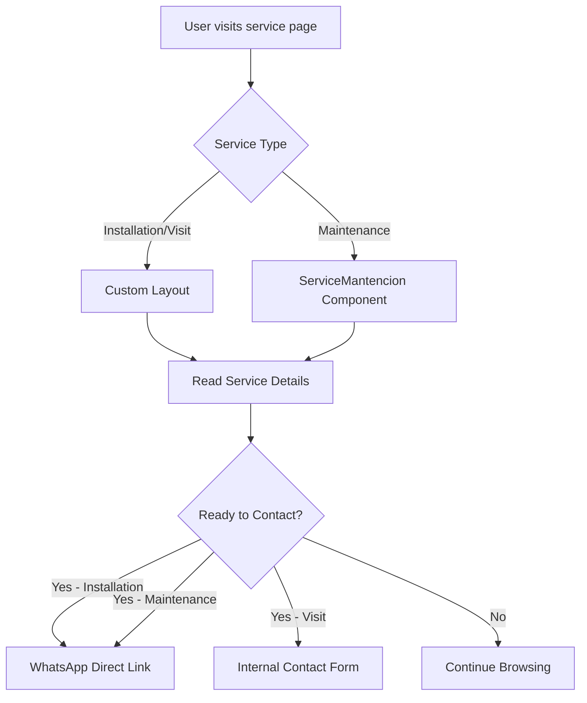

## Overview

Polaris Clima offers four core HVAC services, each with a dedicated page in the `/servicios` directory:

1. **Instalación** (Installation)
2. **Mantenimiento Preventivo** (Preventive Maintenance)
3. **Mantenimiento Correctivo** (Corrective Maintenance)
4. **Visita Técnica** (Technical Visit)

## Service Architecture

```
app/servicios/
├── instalacion/
│   └── page.tsx
├── mantencion-preventiva/
│   └── page.tsx
├── mantencion-correctiva/
│   └── page.tsx
└── visita-tecnica/
    └── page.tsx

components/
└── ServiceMantencion.tsx (reusable layout)
```

## Service Types

### 1. Instalación (Installation)

**Location**: `app/servicios/instalacion/page.tsx`

The installation service uses a custom page layout with:
- Full-screen hero section with background image
- Detailed service inclusions list
- WhatsApp contact integration
- Responsive grid layout

<CodeGroup>
```tsx Service Inclusions
<ul>
  <li>Montaje de la unidad interior</li>
  <li>Montaje de la unidad exterior (condensadora)</li>
  <li>Perforación de la pared (hasta 23 cm)</li>
  <li>Desagüe por gravedad</li>
  <li>Conexión eléctrica (máx. 4 m)</li>
  <li>Instalación de cañerías con aislación (hasta 4 m)</li>
  <li>Puesta en marcha</li>
  <li>Prueba de funcionamiento</li>
  <li>Inducción al cliente</li>
</ul>
```

```tsx WhatsApp Integration
const whatsappMessage = 
  'Hola, me gustaría solicitar el servicio de instalación de aire acondicionado';

<a
  href={`https://wa.me/56979430510?text=${encodeURIComponent(whatsappMessage)}`}
  target="_blank"
  rel="noopener noreferrer"
>
  Solicitar Instalación →
</a>
```
</CodeGroup>

**Key Features**:
- Custom hero layout with image and text grid
- Background image: `/ladrillos-blancos.png`
- Service image: `/products-categories/Instalaciones.png`
- Direct WhatsApp call-to-action

### 2. Mantenimiento Preventivo (Preventive Maintenance)

**Location**: `app/servicios/mantencion-preventiva/page.tsx`

Uses the reusable `ServiceLayout` component with specific props:

<CodeGroup>
```tsx Component Usage
import ServiceLayout from '@/components/ServiceMantencion';

export default function MantenimientoPreventivo() {
  return (
    <ServiceLayout
      image="/products-categories/Mantenimiento2.png"
      title="¿Por qué es Importante el Mantenimiento Preventivo?"
      description={[
        "Garantizar el funcionamiento óptimo y eficiente...",
        "Ahorro de hasta 30% en consumo eléctrico..."
      ]}
      listTitle="¿Qué Incluye el Servicio?"
      bullets={[
        "Limpieza profunda de filtros",
        "Revisión y limpieza de serpentines",
        "Verificación de carga de gas",
        "Revisión eléctrica completa",
        "Limpieza de drenaje",
        "Lubricación de componentes",
        "Medición de temperatura",
        "Informe técnico detallado"
      ]}
      whatsappMessage="Hola, me gustaría solicitar el servicio de mantenimiento"
    />
  );
}
```
</CodeGroup>

**Benefits Highlighted**:
- 30% reduction in electrical consumption
- Prevents costly future repairs
- Improves indoor air quality

### 3. Mantenimiento Correctivo (Corrective Maintenance)

**Location**: `app/servicios/mantencion-correctiva/page.tsx`

Also uses `ServiceLayout` with different content:

<CodeGroup>
```tsx Common Problems Solved
bullets={[
  "Equipo no Enciende",
  "No Enfría o No Calienta",
  "Goteo de Agua",
  "Ruidos Extraños",
  "Malos Olores",
  "Consumo Elevado"
]}
```
</CodeGroup>

**Key Points**:
- Troubleshooting and repair service
- Uses original replacement parts
- Specialized tools for quality repairs
- Extends equipment lifespan

### 4. Visita Técnica (Technical Visit)

**Location**: `app/servicios/visita-tecnica/page.tsx`

Pre-installation assessment service with custom layout:

<CodeGroup>
```tsx Service Inclusions
<ul>
  <li>Asesoría en Terreno para Presupuesto</li>
  <li>Evaluación del espacio de instalación</li>
  <li>Revisión de factibilidad técnica</li>
  <li>Determinación de ubicación ideal</li>
  <li>Evaluación de punto eléctrico</li>
  <li>Revisión de rutas para cañerías y drenaje</li>
  <li>Identificación de requerimientos adicionales</li>
  <li>Recomendación de capacidad del equipo</li>
  <li>Diagnóstico de condiciones estructurales</li>
  <li>Asesoría profesional</li>
</ul>
```

```tsx Internal Link (Not WhatsApp)
<Link
  href="/contacto-visita-tecnica"
  className="bg-green-500 hover:bg-green-600 text-white..."
>
  Solicitar Visita Técnica →
</Link>
```
</CodeGroup>

**Purpose**: Ensures correct installation, avoids errors, prevents cost overruns

## Reusable ServiceMantencion Component

**Location**: `components/ServiceMantencion.tsx`

Shared layout component for maintenance services:

<CodeGroup>
```tsx Props Interface
type ServiceMantencionProps = {
  image: string;
  title: string;
  description: string[];
  listTitle: string;
  bullets: string[];
  whatsappMessage: string;
};
```

```tsx Layout Features
- Fixed background image: url('/ai-generted.jpg')
- Backdrop blur effect: backdrop-blur-sm bg-white/30
- Two-column responsive grid (text + image)
- Sticky image on desktop: lg:sticky lg:top-32
- Checkmark list with orange bullets
- Centered WhatsApp CTA button
```
</CodeGroup>

## Styling Patterns

### Common Classes

<Accordion title="Typography">
- Titles: `text-2xl sm:text-3xl md:text-4xl font-black text-text-primary`
- Body: `text-base md:text-lg leading-relaxed text-gray-700 font-semibold`
- Lists: `text-sm md:text-base text-gray-700 font-bold`
</Accordion>

<Accordion title="Buttons">
```tsx
className="
  inline-flex items-center justify-center gap-2 md:gap-3
  mt-4 md:mt-6
  px-6 md:px-8 py-3 md:py-4
  rounded-xl
  bg-green-500
  text-white text-sm md:text-base font-bold
  transition-all
  hover:bg-green-600
  hover:scale-105
  w-full sm:w-auto
"
```
</Accordion>

<Accordion title="Images">
- Use Next.js Image component with `fill` prop
- Always include `priority` for above-fold images
- Standard rounded corners: `rounded-2xl md:rounded-3xl`
- Shadow: `shadow-2xl`
</Accordion>

## User Flow



## Best Practices

<Warning>
Always encode WhatsApp messages:
```tsx
const message = 'Hola, me gustaría...';
href={`https://wa.me/56979430510?text=${encodeURIComponent(message)}`}
```
</Warning>

<Tip>
Use the `ServiceMantencion` component for new maintenance-type services to maintain consistency.
</Tip>

<Note>
The installation and technical visit pages use custom layouts because they have different content structures and CTAs.
</Note>

## Adding New Services

<Steps>
  <Step title="Determine Service Type">
    Decide if it fits the maintenance layout pattern or needs a custom layout.
  </Step>
  
  <Step title="Create Directory">
    ```bash
    mkdir -p app/servicios/[service-name]
    ```
  </Step>
  
  <Step title="Create Page Component">
    Use existing patterns:
    - For maintenance: Import and use `ServiceMantencion`
    - For custom: Copy from `instalacion` or `visita-tecnica`
  </Step>
  
  <Step title="Add Images">
    Place service image in `/public/products-categories/`
  </Step>
  
  <Step title="Configure WhatsApp Message">
    Customize the pre-filled message for the service
  </Step>
  
  <Step title="Update Navigation">
    Add the new service to the header/footer navigation
  </Step>
</Steps>

## Related Components

- `components/Header.tsx` - Navigation to service pages
- `components/Footer.tsx` - Service links in footer
- `components/WhatsAppButton.tsx` - Floating WhatsApp button